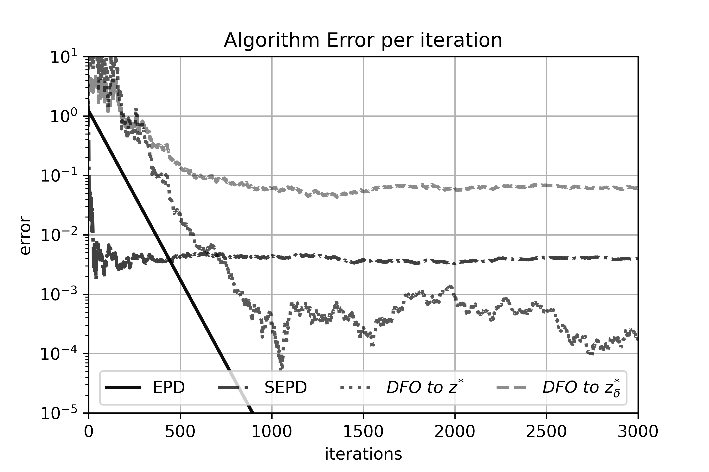

# charging-market
A standalone example for a zero sum charging market problem with a demand-response price model. The problem setup, as well as theoeretical guaruntees for our methods, are provided in our preprint: 

K. Wood and E. Dall'Anese. Stochastic Saddle Point Problems with Decision-Dependent Distributions. *arxiv preprint arxiv:2201.02313*, 2022

The arxiv preprint can be found here https://arxiv.org/abs/2201.02313. A complete work is currently under revision by SIAM Journal of Optimization. 

### Details
This is a python codebase used to generate figures for our work by comparing stochastic methods to compute equilibrium points and saddle points. The data used in our simulations is not provided, but a link to the raw data is found below. Extract raw data into the data/raw_data directory, then run process_data.py to process for experiments. To generate figures found in the paper, run charging_market_test.py. Figures will be stored in the figures folder. 

### Requirements
Raw data can be found here: https://doi.org/10.7799/1827356. 

### Referencing our work

@article{wood2022stochastic,
  title={Stochastic Saddle Point Problems with Decision-Dependent Distributions},
  author={Wood, Killian and Dall'Anese, Emiliano},
  journal={arXiv preprint arXiv:2201.02313},
  year={2022}
}
